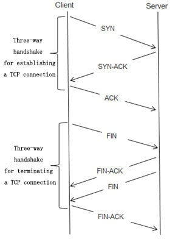

# Unit 7 — Network Programming
### BT151CO · Detailed Lecture Notes

---

| | |
|---|---|
| **Duration** | 4 Hours |
| **CLO** | CLO 5 — Write client and server programs using Python's socket library |
| **Pre-requisite** | Unit 3 (Exception Handling), Unit 6 (File & Database I/O) |

---

## Table of Contents

1. [Introduction to Network Programming](#1-introduction-to-network-programming)
2. [A Daytime Server Example](#2-a-daytime-server-example)
3. [Clients and Servers](#3-clients-and-servers)
4. [Writing the Client Program](#4-writing-the-client-program)
5. [Writing the Server Program](#5-writing-the-server-program)
6. [Summary and Key Takeaways](#6-summary-and-key-takeaways)

---


# 1. Introduction to Network Programming


## 1.1 Why Do Programs Need to Talk to Each Other?

Every time you open a browser, send a message, or load a game leaderboard, your computer is having a conversation with another computer somewhere in the world. That conversation is **network programming**.

In all previous units, your programs ran entirely on *your* machine — they read files, used databases, and printed output to *your* screen. Network programming opens a new dimension: your program can now **send data to** and **receive data from** programs running on completely different machines, anywhere on the internet.

### Real-World Motivation

| Everyday Action | What Is Actually Happening |
|---|---|
| Open `google.com` | Your browser (client) asks Google's server for a web page |
| Send a WhatsApp message | App (client) sends text to WhatsApp's server; friend's app receives it |
| Play an online game | Game (client) sends your moves to a game server; server broadcasts to opponents |
| Library catalogue search | Library website (client) queries a remote database server |

All of these are built on the same fundamental concept: **a client asks, a server responds**.

---

## 1.2 What Is a Network?

A **network** is two or more computers that are connected and can exchange data.

- A **Local Area Network (LAN)** connects computers in one room or building (e.g., a school lab).
- A **Wide Area Network (WAN)** spans cities, countries, or the whole planet — the internet is a WAN.

### Key Terms You Must Know

| Term | Meaning | Analogy |
|---|---|---|
| **IP Address** | A unique number that identifies a machine on a network | A postal address for your computer |
| **Port** | A number (0–65535) that identifies a specific service on a machine | A door in the building — the address gets you to the building, the port gets you to the right flat |
| **Protocol** | A set of rules both sides agree to follow | A language both speakers must share |
| **Socket** | An endpoint for communication — one end of a two-way pipe | A phone handset — plug it in and you can send/receive |
| **Client** | A program that initiates the connection and makes requests | A customer who walks into a shop |
| **Server** | A program that waits for connections and responds to requests | The shopkeeper who waits and serves |

> **Analogy — The Post Office:**  
> Imagine your program wants to send a letter. Your IP address is your home address. The port is the department at the destination building (e.g., department 80 handles post for the website, department 25 handles email). A socket is the act of picking up the pen and writing — it is your point of contact with the postal system.

---

## 1.3 What Is a Protocol?

A **protocol** is an agreed set of rules for how data is formatted, sent, and received. Both sides must speak the same protocol or the conversation fails — like two people speaking different languages.

| Protocol | Port | Used for |
|---|---|---|
| **HTTP** | 80 | Web pages |
| **HTTPS** | 443 | Encrypted web pages |
| **SMTP** | 25 | Sending email |
| **FTP** | 21 | File transfer |
| **DNS** | 53 | Translating domain names to IP addresses |
| **Custom** | Any free port | Your own programs |

> You will write a **custom protocol** in this unit — you decide the rules for how your client and server talk to each other.

**How Ports Work**

When a device communicates over a network, data packets are sent to its IP address. Each packet also includes a port number, which tells the operating system which application or service should receive that data.
- **Port numbers identify services**: Each application listens on a specific port, so incoming data reaches the correct program.
- **IP + Port + Protocol = Socket**: This combination ensures that network traffic is delivered precisely to the right process on the right device. (Note: Also IP version as well, IPv4 or IPv6)
- **TCP and UDP protocols use ports differently**: TCP ensures reliable delivery, while UDP is faster but without guaranteed delivery.
Ports act like entry doors for data — the IP brings the data to the device, and the port directs it to the correct application.

---

## 1.4 TCP vs UDP

There are two main ways to send data across a network:

| Feature | **TCP** (Transmission Control Protocol) | **UDP** (User Datagram Protocol) |
|---|---|---|
| **Reliability** | Guaranteed delivery — data is re-sent if lost | Fire-and-forget — no guarantee |
| **Order** | Data arrives in the order it was sent | May arrive out of order |
| **Speed** | Slightly slower (checks + re-sends) | Very fast (no checks) |
| **Use cases** | Web pages, email, file transfer, chat | Video streaming, online games, DNS |
| **Analogy** | Recorded delivery letter | Dropping a leaflet out of a plane |

> **In this unit we use TCP** — it is the reliable choice and the foundation of most client-server applications.

---

## 1.5 What Is a Socket?

A **socket** is a programming object that represents one end of a two-way communication channel between two programs — which may be on the same machine or on opposite sides of the world.

Python's built-in `socket` module gives you everything you need:

```python
import socket   # no pip install — already in Python
```

A socket has two key properties:
1. **Address family** — `socket.AF_INET` means IPv4 (the standard internet address format)
2. **Socket type**:
    - `socket.SOCK_STREAM` means TCP (reliable, ordered, stream-based) and 
    - `socket.SOCK_DGRAM` for UDP

```python
# Create a TCP socket
sock = socket.socket(socket.AF_INET, socket.SOCK_STREAM)
```

> Think of `AF_INET` as choosing "use the internet road network" and `SOCK_STREAM` as choosing "use a lorry with tracking" (TCP) rather than "throw the parcel out of a helicopter" (UDP).

---

## 1.6 What Is `localhost` and Port `127.0.0.1`?

When developing network programs, you will run the client and server **on the same machine**. To do this:

- `'localhost'` or `'127.0.0.1'` means "this machine" — it never leaves your computer
- Any port number above 1023 can be used for your own programs (ports below 1024 are reserved for system services)

```python
HOST = 'localhost'  # or '127.0.0.1' — same machine
PORT = 65432        # choose any number 1024–65535
```

> **Analogy:** `localhost` is like sending a letter to yourself at your own address — it goes to your own letterbox without entering the postal system at all.

---

---

# 2. A Daytime Server Example

---

## 2.1 What Is a Daytime Server?

A **Daytime Server** is the simplest useful network service in existence. Its job is exactly this:

1. A client connects
2. The server sends back the current date and time as a text string
3. The connection closes

That's it. No requests, no passwords, no complex protocol. It is the "Hello, World" of network programming.

The original Daytime Protocol is a real internet standard (RFC 867, published 1983) and runs on **port 13**. We will build our own version on a custom port.

> **Analogy:** A daytime server is like a talking clock service you phone — you dial the number, the automated voice reads out the current time, and hangs up. You don't send any request — the server just speaks when you connect.

---

## 2.2 The Complete Daytime Server

```python
# daytime_server.py
# A simple server that sends the current date and time to any client that connects.

import socket
import datetime


HOST = 'localhost'  # Listen on the local machine only
PORT = 17000        # Any free port above 1023


def run_daytime_server():
    """Start the daytime server and listen for connections."""

    # 1. Create a TCP socket
    with socket.socket(socket.AF_INET, socket.SOCK_STREAM) as server_socket:

        # 2. Allow the port to be reused immediately after the program restarts
        server_socket.setsockopt(socket.SOL_SOCKET, socket.SO_REUSEADDR, 1)

        # 3. Bind — attach the socket to the address and port
        server_socket.bind((HOST, PORT))

        # 4. Listen — start accepting connections (queue up to 5)
        server_socket.listen(5)
        print(f"Daytime server running on {HOST}:{PORT}")
        print("Press Ctrl+C to stop.\n")

        while True:
            # 5. Accept — pause here until a client connects
            client_socket, client_address = server_socket.accept()
            with client_socket:
                print(f"Connection from {client_address}")

                # 6. Prepare the response — current date and time
                now = datetime.datetime.now()
                message = now.strftime("%A, %d %B %Y  %H:%M:%S\n")

                # 7. Send — data must be bytes, not a string
                client_socket.sendall(message.encode('utf-8'))
                print(f"Sent: {message.strip()}")
            # client_socket closes automatically here (with block ends)


if __name__ == '__main__':
    run_daytime_server()
```

```output
Daytime server running on localhost:17000
Press Ctrl+C to stop.

Connection from ('127.0.0.1', 54321)
Sent: Saturday, 24 May 2026  14:32:07
```

---

## 2.3 The Daytime Client

```python
# daytime_client.py
# Connects to the daytime server and prints the current time.

import socket


HOST = 'localhost'
PORT = 17000


def get_server_time():
    """Connect to the daytime server and print the response."""

    # 1. Create a TCP socket
    with socket.socket(socket.AF_INET, socket.SOCK_STREAM) as client_socket:

        # 2. Connect to the server
        client_socket.connect((HOST, PORT))
        print(f"Connected to {HOST}:{PORT}")

        # 3. Receive the response (up to 1024 bytes)
        data = client_socket.recv(1024)

        # 4. Decode bytes to string and display
        print(f"Server time: {data.decode('utf-8').strip()}")
    # client_socket closes automatically here


if __name__ == '__main__':
    get_server_time()
```

```output
Connected to localhost:17000
Server time: Saturday, 24 May 2026  14:32:07
```

---

## 2.4 Walking Through the Daytime Example — Step by Step

The six steps in the server are the template for **every server you will ever write**:

| Step | Server Code | Purpose |
|---|---|---|
| 1 | `socket.socket(...)` | Create the socket endpoint |
| 2 | `setsockopt(SO_REUSEADDR)` | Avoid "address in use" errors on restart |
| 3 | `bind((HOST, PORT))` | "Register" this address and port |
| 4 | `listen(5)` | Start accepting connections (queue size 5) |
| 5 | `accept()` | Block (wait) until a client arrives |
| 6 | `sendall(...)` | Send data to the client |

The three steps in the client:

| Step | Client Code | Purpose |
|---|---|---|
| 1 | `socket.socket(...)` | Create the socket endpoint |
| 2 | `connect((HOST, PORT))` | Reach out to the server |
| 3 | `recv(1024)` | Receive up to 1024 bytes |

> **Key insight:** The client and server are mirror images. The server calls `bind()` + `listen()` + `accept()`. The client calls `connect()`. After the connection is made, both sides use `send()` / `recv()` identically.

---

---

# 3. Clients and Servers

---

## 3.1 The Client-Server Model

The client-server model is the dominant architecture of networked software. Understanding it deeply will help you design any networked system.


### Responsibilities

| Role | Responsibilities | Real-World Examples |
|---|---|---|
| **Client** | Initiates the connection, sends requests, processes responses | Web browser, mobile app, game client, library catalogue app |
| **Server** | Waits for connections, processes requests, sends responses, can serve many clients | Google's web server, WhatsApp's message server, online game server |

### Key Differences

| Property | Client | Server |
|---|---|---|
| Who starts? | **Client** always initiates | Server waits passively |
| How many? | One per connection | One server → many clients |
| Port | Uses a **random** ephemeral port | Uses a **fixed, known** port |
| Lifecycle | Short-lived — one task then done | Long-lived — runs continuously |

> **Analogy — The Library:**
> A library server is the librarian. Clients are students who walk in. The librarian (server) is always at the desk (always listening). A student (client) walks up (initiates connection) and asks for a book (sends a request). The librarian finds it and hands it over (sends a response). The student leaves (connection closes). The librarian stays at the desk for the next student.

---

## 3.2 How a TCP Connection Is Established — The Three-Way Handshake

Before any data can be sent, TCP performs a "handshake" to establish the connection:

<!-- ```
Client                          Server
  │                                 │
  │ ── SYN ──────────────────────▶  │  "Can we connect?"
  │                               │
  │◀── SYN-ACK ───────────────────│  "Yes, I'm ready."
  │                               │
  │ ── ACK ──────────────────────▶│  "Great, let's go."
  │                               │
  │ ═══ DATA FLOWS BOTH WAYS ════ │
  │                               │
  │ ── FIN ──────────────────────▶│  "I'm done."
  │◀── FIN-ACK ───────────────────│  "Acknowledged."
``` -->



Source: [ResearchGate](https://www.researchgate.net/publication/357087992/figure/fig1/AS:1101624634294272@1639659188207/Packet-interaction-in-TCP-connection-establishment-and-termination_W640.jpg)

Python's `socket` library handles this automatically — you just call `connect()` and `accept()` and the handshake happens behind the scenes.

---

## 3.3 What Is a Port and Why Does It Matter?

Your computer has a single IP address but can run **thousands of services simultaneously**. Ports make this possible — they are like apartment numbers in a building.

```
Computer IP: 192.168.1.50
│
├── Port 80   → Web server (HTTP)
├── Port 443  → Secure web server (HTTPS)
├── Port 5432 → PostgreSQL database
├── Port 65432 → Your Python server
└── Port 54321 → Your Python client (assigned by OS)
```

- **Well-known ports (0–1023):** Reserved for system services. Require admin privileges to use.
- **Registered ports (1024–49151):** Registered for specific applications (e.g., PostgreSQL uses 5432).
- **Dynamic/ephemeral ports (49152–65535):** Assigned automatically by the OS to clients.

> **Rule of thumb:** Use ports in the range **10000–65000** for your own programs to avoid conflicts.

---

## 3.4 Handling Multiple Clients

The daytime server above handles one client at a time — it finishes with one client before accepting the next. This is called **sequential** or **iterative** serving.

For more demanding servers, you need to handle clients **concurrently** (at the same time). There are three main approaches:

| Approach | Mechanism | When to use |
|---|---|---|
| **Sequential** | One client at a time (loop) | Simple, low-traffic servers |
| **Threading** | `threading.Thread` per client | When clients remain connected for longer periods |
| **Non-blocking / async** | `asyncio` or `select()` | High performance, many simultaneous clients |

> In this unit we will use the **sequential** model for simplicity, and introduce **threading** to show how to serve multiple clients.

---

## 3.5 Sockets Are Bidirectional

Once a connection is established, **both sides can send AND receive** — it is a two-way pipe:

```
Client socket ══════════════════ Server socket
       │ ── "Hello, server!" ──▶ │
       │ ◀── "Hello, client!" ── │
       │ ── "Give me data." ───▶ │
       │ ◀── [the data] ──────── │
```

After calling `accept()`, the server has **two** sockets:
- The **server socket** (keeps listening for new clients)
- The **client socket** (dedicated to this one client — used for all communication)

---

## 3.6 Threads

A `thread` is the smallest unit of execution that can be scheduled by an operating system. It represents a sequence of instructions that can run independently within a process.

Key points:
- A process is an instance of a running program.
- A thread is an execution path inside that process.
- A single process can contain multiple threads.

You can think of a process as a container that owns resources, while threads are workers that execute code using those resources.

|Process| Thread|
| --------------------------------------------------------------- | --------------------------------------------------------- |
| A process is an independent running program.                    | A thread is a smaller unit of execution inside a process. |
| Has its **own memory**.                                         | Shares memory with other threads in the same process.     |
| Processes are isolated from each other.                         | Threads can easily communicate because they share data.   |
| If one process crashes, other processes are usually unaffected. | If one thread crashes, it may affect the entire process.  |


Imagine you're writing a document while listening to music.

- Process: The word processor and the music player are two separate processes.
- Thread: Inside the word processor:
    - One thread checks spelling.
    - Another thread saves your work automatically.
    - Another thread responds to your typing.

All these threads work together inside the same program.

A thread typically goes through the following states:

- New – Thread is created but not yet started
- Runnable – Thread is ready to run and waiting for CPU time
- Running – Thread is currently executing on a CPU
- Blocked / Waiting – Thread is waiting for a resource or event
- Terminated – Thread has finished execution


---

# 4. Writing the Client Program

---

## 4.1 The Client Template

Every TCP client follows this pattern:

```
create socket → connect → send / receive (loop if needed) → close
```

Here is the minimal client template:

```python
import socket

HOST = 'localhost'
PORT = 65432

with socket.socket(socket.AF_INET, socket.SOCK_STREAM) as sock:
    sock.connect((HOST, PORT))
    sock.sendall(b'Hello, server!')
    data = sock.recv(1024)
    print(f'Received: {data.decode()}')
```

> **Important:** `sendall()` is preferred over `send()`. The `send()` method may not send all bytes at once (it returns the number actually sent). `sendall()` loops internally until everything is sent.

---

## 4.2 Bytes vs Strings — The Most Common Beginner Mistake

**Sockets transmit bytes, not strings.** You must always convert:

| Direction | Operation | Code |
|---|---|---|
| String → Bytes (to send) | Encode | `'hello'.encode('utf-8')` or `b'hello'` |
| Bytes → String (to read) | Decode | `data.decode('utf-8')` |

```python
# ❌ Wrong — sends a Python string object
sock.sendall('Hello')          # TypeError: a bytes-like object is required

# ✅ Correct — sends bytes
sock.sendall('Hello'.encode('utf-8'))
sock.sendall(b'Hello')         # b prefix makes it a bytes literal
```

---

## 4.3 A Complete Echo Client

The "echo" pattern is the simplest interactive client — you type a message, the server sends it back unchanged.

```python
# echo_client.py
# Sends a message to an echo server and prints the response.

import socket


HOST = 'localhost'
PORT = 65432
BUFFER_SIZE = 1024  # max bytes to receive at once


def run_echo_client():
    """Connect to the echo server, send a message, print the reply."""

    with socket.socket(socket.AF_INET, socket.SOCK_STREAM) as sock:
        sock.connect((HOST, PORT))
        print(f"Connected to {HOST}:{PORT}")

        message = input("Enter a message to send: ")

        # Encode string to bytes before sending
        sock.sendall(message.encode('utf-8'))

        # Receive the echoed response
        data = sock.recv(BUFFER_SIZE)

        # Decode bytes back to string for display
        print(f"Echo received: {data.decode('utf-8')}")

    print("Connection closed.")


if __name__ == '__main__':
    run_echo_client()
```

```output
Connected to localhost:65432
Enter a message to send: Hello from the student client!
Echo received: Hello from the student client!
Connection closed.
```

---

## 4.4 A Library Search Client

Here is a more realistic client — it sends a book title search query to a library server and receives a response:

```python
# library_client.py
# Sends a book search query to the library server.

import socket
import json


HOST = 'localhost'
PORT = 65000
BUFFER_SIZE = 4096


def search_library(query):
    """Send a search query to the library server and return the result."""

    with socket.socket(socket.AF_INET, socket.SOCK_STREAM) as sock:
        try:
            sock.connect((HOST, PORT))

            # Build a request as JSON — structured, readable, unambiguous
            request = json.dumps({'action': 'search', 'query': query})
            sock.sendall(request.encode('utf-8'))

            # Receive and decode the response
            raw_response = sock.recv(BUFFER_SIZE)
            response = json.loads(raw_response.decode('utf-8'))

            return response

        except ConnectionRefusedError:
            print(f"Error: Could not connect to {HOST}:{PORT}.")
            print("Is the library server running?")
            return None


if __name__ == '__main__':
    title = input("Search for book: ")
    result = search_library(title)

    if result:
        if result.get('found'):
            books = result['books']
            print(f"\nFound {len(books)} book(s):")
            for book in books:
                print(f"  [{book['id']}] {book['title']} by {book['author']}"
                      f"  — {'Available' if book['available'] else 'On loan'}")
        else:
            print(f"No books found matching '{title}'.")
```

---

## 4.5 Error Handling in the Client

Network connections can fail at any point. Always wrap client code in `try / except`:

| Exception | Cause | How to Handle |
|---|---|---|
| `ConnectionRefusedError` | Server is not running | Print a friendly error message |
| `TimeoutError` | Server is too slow or unreachable | `sock.settimeout(5)` then catch `socket.timeout` |
| `socket.gaierror` | Hostname could not be resolved | Check the HOST value |
| `ConnectionResetError` | Server closed connection unexpectedly | Log the error, retry if appropriate |
| `OSError` | General OS-level socket failure | Catch as fallback |

```python
import socket

HOST = 'localhost'
PORT = 65432

try:
    with socket.socket(socket.AF_INET, socket.SOCK_STREAM) as sock:
        sock.settimeout(5)                 # timeout after 5 seconds
        sock.connect((HOST, PORT))
        sock.sendall(b'Hello')
        data = sock.recv(1024)
        print(data.decode('utf-8'))

except ConnectionRefusedError:
    print("Server is not running. Please start the server first.")
except socket.timeout:
    print("Connection timed out. Server may be busy.")
except socket.gaierror as e:
    print(f"Address error: {e}")
except OSError as e:
    print(f"Socket error: {e}")
```

---

## 4.6 Common Client Mistakes

| Mistake | Symptom | Fix |
|---|---|---|
| Sending a string instead of bytes | `TypeError: a bytes-like object is required` | Use `.encode('utf-8')` or `b''` prefix |
| Not decoding the response | `b'Hello'` printed instead of `'Hello'` | Use `.decode('utf-8')` |
| Using `send()` instead of `sendall()` | Data occasionally truncated on large messages | Always use `sendall()` |
| Connecting before server is running | `ConnectionRefusedError` | Start the server first |
| Using the wrong port | `ConnectionRefusedError` | Check `PORT` matches the server |
| Not closing the socket | File descriptor leak | Always use `with` |
| No timeout set | Program hangs forever waiting for a response | `sock.settimeout(n)` |

---

---

# 5. Writing the Server Program

---

## 5.1 The Server Template

Every TCP server follows this pattern:

```
create socket → set options → bind → listen → loop: accept → handle → close client
```

```python
import socket

HOST = 'localhost'
PORT = 65432

with socket.socket(socket.AF_INET, socket.SOCK_STREAM) as server_socket:
    server_socket.setsockopt(socket.SOL_SOCKET, socket.SO_REUSEADDR, 1)
    server_socket.bind((HOST, PORT))
    server_socket.listen(5)
    print(f"Server listening on {HOST}:{PORT}")

    while True:
        client_socket, addr = server_socket.accept()  # blocks here
        with client_socket:
            data = client_socket.recv(1024)
            client_socket.sendall(data)  # echo back
```

---

## 5.2 `SO_REUSEADDR` — Why Is It Essential?

```python
server_socket.setsockopt(socket.SOL_SOCKET, socket.SO_REUSEADDR, 1)
```

Without this line, if your server crashes or you stop it with `Ctrl+C`, the OS keeps the port in a `TIME_WAIT` state for up to 2 minutes. When you try to restart the server, you get:

```
OSError: [Errno 98] Address already in use
```

`SO_REUSEADDR` tells the OS: "let me reuse this port immediately, even if it's in TIME_WAIT." **Always include this line in every server you write.**

---

## 5.3 The Echo Server — Iterative (One Client at a Time)

```python
# echo_server_simple.py
# Accepts one client connection at a time and echoes messages back.

import socket


HOST = 'localhost'
PORT = 65432
BUFFER_SIZE = 1024


def run_echo_server():
    """Start a simple iterative echo server."""

    with socket.socket(socket.AF_INET, socket.SOCK_STREAM) as server_socket:
        server_socket.setsockopt(socket.SOL_SOCKET, socket.SO_REUSEADDR, 1)
        server_socket.bind((HOST, PORT))
        server_socket.listen(5)
        print(f"Echo server running on {HOST}:{PORT}")
        print("Waiting for a client...\n")

        while True:
            # Block here until a client connects
            client_socket, client_address = server_socket.accept()
            print(f"Client connected: {client_address}")

            with client_socket:
                while True:
                    # Receive data (up to BUFFER_SIZE bytes)
                    data = client_socket.recv(BUFFER_SIZE)

                    if not data:
                        # Empty data means the client has disconnected
                        print(f"Client {client_address} disconnected.")
                        break

                    # Echo the data back unchanged
                    client_socket.sendall(data)
                    print(f"Echoed: {data.decode('utf-8')!r}")


if __name__ == '__main__':
    run_echo_server()
```

```output
Echo server running on localhost:65432
Waiting for a client...

Client connected: ('127.0.0.1', 54321)
Echoed: 'Hello from the student client!'
Client ('127.0.0.1', 54321) disconnected.
```

---

## 5.4 `recv()` and the Empty Data Signal

```python
data = client_socket.recv(BUFFER_SIZE)
if not data:
    break
```

This is the **standard pattern** for detecting that a client has disconnected:

- `recv()` blocks (waits) until data arrives
- When the client calls `close()` (or the `with` block ends), the server's `recv()` returns **`b''`** (empty bytes)
- `if not data:` catches this — `b''` is falsy in Python
- The server then breaks out of the inner loop and accepts the next client

> **Never ignore the `if not data: break` check.** Without it, your server will loop forever reading empty data after a client disconnects, consuming 100% CPU.

---

## 5.5 A Multi-Client Server Using Threads

The simple echo server above can only talk to one client at a time. While it is talking to client A, client B must wait. For most real applications, you want to handle clients **simultaneously**.

The solution is to spawn a **new thread** for each connected client:

```python
# echo_server_threaded.py
# Handles multiple clients simultaneously using threads.

import socket
import threading


HOST = 'localhost'
PORT = 65433
BUFFER_SIZE = 1024


def handle_client(client_socket, client_address):
    """
    Handle one client connection in its own thread.
    This function runs independently for every connected client.
    """
    print(f"[Thread] Serving {client_address}")

    with client_socket:
        while True:
            try:
                data = client_socket.recv(BUFFER_SIZE)
                if not data:
                    break
                client_socket.sendall(data)
                print(f"[{client_address}] Echoed: {data.decode('utf-8')!r}")
            except ConnectionResetError:
                break

    print(f"[Thread] {client_address} disconnected.")


def run_threaded_server():
    """Start a threaded echo server that handles multiple clients at once."""

    with socket.socket(socket.AF_INET, socket.SOCK_STREAM) as server_socket:
        server_socket.setsockopt(socket.SOL_SOCKET, socket.SO_REUSEADDR, 1)
        server_socket.bind((HOST, PORT))
        server_socket.listen(10)
        print(f"Threaded echo server on {HOST}:{PORT}")

        while True:
            client_socket, client_address = server_socket.accept()
            print(f"Connection from {client_address}")

            # Create a new thread for each client
            client_thread = threading.Thread(
                target=handle_client,
                args=(client_socket, client_address),
                daemon=True      # thread exits when main program exits
            )
            client_thread.start()
            print(f"Active threads: {threading.active_count() - 1}")


if __name__ == '__main__':
    run_threaded_server()
```

```output
Threaded echo server on localhost:65433
Connection from ('127.0.0.1', 54321)
Active threads: 1
[Thread] Serving ('127.0.0.1', 54321)
Connection from ('127.0.0.1', 54322)
Active threads: 2
[Thread] Serving ('127.0.0.1', 54322)
[127.0.0.1, 54321)] Echoed: 'Hello!'
```

---

## 5.6 A Protocol-Based Chat Server

A **protocol** is the agreement between client and server about how messages are structured. Here is a simple protocol:

- Every message is a line of text ending in `\n`
- The server reads one full line and responds with a full line
- Special commands: `QUIT` closes the connection

```python
# chat_server.py
# A simple chat server with a line-based text protocol.

import socket
import threading
import datetime


HOST = 'localhost'
PORT = 65434


def handle_chat_client(client_socket, address):
    """Process line-based messages from one chat client."""

    name = None

    with client_socket:
        # Greet the client
        client_socket.sendall(b"Welcome! Enter your name: ")

        # Use makefile() to work with lines more easily
        conn_file = client_socket.makefile('rwb')

        # First message: the client's name
        raw = conn_file.readline()
        if not raw:
            return
        name = raw.decode('utf-8').strip()
        print(f"[Chat] {address} identified as '{name}'")

        welcome_msg = f"Hello, {name}! Type a message (QUIT to exit).\n"
        client_socket.sendall(welcome_msg.encode('utf-8'))

        # Message loop
        while True:
            raw = conn_file.readline()
            if not raw:
                break
            message = raw.decode('utf-8').strip()

            if message.upper() == 'QUIT':
                goodbye = f"Goodbye, {name}! See you later.\n"
                client_socket.sendall(goodbye.encode('utf-8'))
                break

            timestamp = datetime.datetime.now().strftime('%H:%M')
            reply = f"[{timestamp}] Server received: {message}\n"
            client_socket.sendall(reply.encode('utf-8'))
            print(f"[Chat] {name} said: {message!r}")

    print(f"[Chat] {name} ({address}) disconnected.")


def run_chat_server():
    with socket.socket(socket.AF_INET, socket.SOCK_STREAM) as server_socket:
        server_socket.setsockopt(socket.SOL_SOCKET, socket.SO_REUSEADDR, 1)
        server_socket.bind((HOST, PORT))
        server_socket.listen(5)
        print(f"Chat server on {HOST}:{PORT}")

        while True:
            client_socket, address = server_socket.accept()
            t = threading.Thread(
                target=handle_chat_client,
                args=(client_socket, address),
                daemon=True
            )
            t.start()


if __name__ == '__main__':
    run_chat_server()
```

---

## 5.7 The Library Server — Full Example

Combining sockets with the SQLite database from Unit 6, here is a practical server that answers book search queries:

```python
# library_server.py
# A server that queries a SQLite library database and returns results as JSON.

import socket
import threading
import sqlite3
import json


HOST = 'localhost'
PORT = 65000
BUFFER_SIZE = 4096
DB_FILE = ':memory:'   # In-memory DB for demo; use a .db file in production


def setup_library_db():
    """Create and populate the in-memory library database."""
    conn = sqlite3.connect(DB_FILE)
    cursor = conn.cursor()
    cursor.execute("""
        CREATE TABLE IF NOT EXISTS books (
            book_id   INTEGER PRIMARY KEY AUTOINCREMENT,
            title     TEXT NOT NULL,
            author    TEXT NOT NULL,
            available INTEGER DEFAULT 1
        )
    """)
    cursor.executemany(
        'INSERT INTO books (title, author, available) VALUES (?, ?, ?)',
        [
            ('Python Crash Course',       'Eric Matthes',   1),
            ('Automate the Boring Stuff', 'Al Sweigart',    1),
            ('Clean Code',               'Robert Martin',  0),
            ('The Pragmatic Programmer', 'Hunt & Thomas',  1),
        ]
    )
    conn.commit()
    return conn


# Note: In production, use a connection pool. For this demo a single
# shared connection is acceptable since we use threading and SQLite's
# WAL mode handles concurrent reads safely.
LIBRARY_CONN = setup_library_db()


def handle_library_client(client_socket, address):
    """Handle one library client request."""
    with client_socket:
        raw = client_socket.recv(BUFFER_SIZE)
        if not raw:
            return

        try:
            request = json.loads(raw.decode('utf-8'))
        except json.JSONDecodeError:
            error = json.dumps({'error': 'Invalid JSON request'})
            client_socket.sendall(error.encode('utf-8'))
            return

        action = request.get('action', '')

        if action == 'search':
            query = request.get('query', '')
            cursor = LIBRARY_CONN.cursor()
            cursor.execute(
                'SELECT book_id, title, author, available FROM books'
                ' WHERE title LIKE ? OR author LIKE ?',
                (f'%{query}%', f'%{query}%')
            )
            rows = cursor.fetchall()

            if rows:
                books = [
                    {
                        'id': r[0],
                        'title': r[1],
                        'author': r[2],
                        'available': bool(r[3]),
                    }
                    for r in rows
                ]
                response = json.dumps({'found': True, 'books': books})
            else:
                response = json.dumps({'found': False, 'books': []})

        else:
            response = json.dumps({'error': f'Unknown action: {action}'})

        client_socket.sendall(response.encode('utf-8'))
        print(f"[Library] Served '{action}' request from {address}")


def run_library_server():
    with socket.socket(socket.AF_INET, socket.SOCK_STREAM) as server_socket:
        server_socket.setsockopt(socket.SOL_SOCKET, socket.SO_REUSEADDR, 1)
        server_socket.bind((HOST, PORT))
        server_socket.listen(5)
        print(f"Library server on {HOST}:{PORT}")

        while True:
            client_socket, address = server_socket.accept()
            t = threading.Thread(
                target=handle_library_client,
                args=(client_socket, address),
                daemon=True
            )
            t.start()


if __name__ == '__main__':
    run_library_server()
```

---

## 5.8 How to Run Client and Server Together

Running a client-server pair requires **two terminal windows**:

```
Terminal 1 (Server)          Terminal 2 (Client)
─────────────────────        ─────────────────────
python echo_server.py        (wait for server to start)
                             python echo_client.py
```

**Step-by-step:**

1. Open **Terminal 1** — start the server:
   ```
   python echo_server_simple.py
   ```
   Wait until you see: `Echo server running on localhost:65432`

2. Open **Terminal 2** — run the client:
   ```
   python echo_client.py
   ```

3. Type a message and press Enter — watch it echoed back.

4. To stop the server: press **`Ctrl+C`** in Terminal 1.

> **Important:** Always start the server **before** the client. The client will immediately `ConnectionRefusedError` if the server is not listening.

---

## 5.9 Common Server Mistakes

| Mistake | Symptom | Fix |
|---|---|---|
| Forgetting `SO_REUSEADDR` | `OSError: Address already in use` on restart | Always include `setsockopt(SO_REUSEADDR, 1)` |
| Forgetting the `while True:` loop | Server handles exactly one client then exits | Wrap `accept()` in a `while True:` loop |
| Not checking `if not data: break` | CPU spins at 100% after client disconnects | Always check for empty `recv()` |
| Binding to `'localhost'` but connecting to an IP | `ConnectionRefusedError` from other machines | Use `''` or `'0.0.0.0'` to listen on all interfaces |
| Sending a string with `sendall` | `TypeError` | Encode first: `.encode('utf-8')` |
| Not handling `ConnectionResetError` | Server crashes when client abruptly disconnects | Wrap `recv` in `try / except ConnectionResetError` |
| Daemon threads not set | Server won't exit cleanly on `Ctrl+C` | `daemon=True` in `threading.Thread(...)` |

---

## 5.10 Security Best Practices

> ⚠️ These practices apply to any production network program.

1. **Never bind to `0.0.0.0` in development** — it exposes your server to the whole network. Use `'localhost'` during development and only expose externally when intentional.
2. **Always validate and sanitise input from the client** — a client can send anything, including malformed JSON, SQL injection strings, or extremely large payloads.
3. **Set a maximum receive size** — never use an unlimited buffer. Always specify a byte limit in `recv(n)`.
4. **Set a timeout on the client socket** — so a slow or malicious client cannot block your server forever.
5. **Do not send raw exception messages to the client** — they reveal internal details. Log them server-side and send generic error codes to the client.
6. **Use TLS/SSL for any production system** — raw sockets transmit data in plain text. Python's `ssl` module wraps sockets with encryption.

---

---

# 6. Summary and Key Takeaways

---

## 6.1 Concept Map

```
Network Programming
│
├── Concepts
│   ├── IP Address    — where to send data
│   ├── Port          — which service on the machine
│   ├── Protocol      — rules for how to communicate
│   └── Socket        — the Python object that does it all
│
├── TCP vs UDP
│   ├── TCP — reliable, ordered (we use this)
│   └── UDP — fast, unreliable (video/games)
│
├── Client                     Server
│   ├── socket()               ├── socket()
│   ├── connect()              ├── setsockopt()
│   ├── sendall()              ├── bind()
│   └── recv()                 ├── listen()
│                              ├── accept()
│                              ├── recv() / sendall()
│                              └── loop forever
│
└── Patterns
    ├── Echo          — receive and send back unchanged
    ├── Daytime       — server sends; client reads
    ├── Request/Reply — client sends command; server responds
    └── Threaded      — one thread per client
```

---

## 6.2 The Five Rules of Network Programming

1. **Always use `with`** — sockets must be closed. The `with` statement ensures cleanup even if an error occurs.
2. **Always encode before sending, decode after receiving** — sockets deal in bytes, not strings.
3. **Always use `sendall()`, not `send()`** — `send()` may only send part of your data.
4. **Always check `if not data: break`** — empty `recv()` means the other side has disconnected.
5. **Always handle exceptions** — networks fail. `ConnectionRefusedError`, `TimeoutError`, and `OSError` must be caught.

---

## 6.3 Key Takeaways by Topic

### Introduction to Network Programming
- A **socket** is a two-way communication endpoint
- `socket.AF_INET` = IPv4; `socket.SOCK_STREAM` = TCP
- `localhost` / `127.0.0.1` = this machine; useful for development
- Ports 0–1023 are reserved; use 10000+ for your own programs

### Clients and Servers
- The **client always initiates** the connection
- The **server always waits** (bind → listen → accept)
- TCP is **reliable and ordered** — the right choice for most applications
- The `if not data: break` pattern detects client disconnection

### The Daytime Server Example
- Simplest useful server pattern: connect → send time → disconnect
- Template for any "serve one piece of information" server
- Introduces the six-step server pattern and three-step client pattern

### Writing the Client
- `connect()` → `sendall()` → `recv()` → close
- Always `.encode('utf-8')` before sending, `.decode('utf-8')` after receiving
- `settimeout(n)` prevents hanging forever
- Wrap in `try / except ConnectionRefusedError`

### Writing the Server
- `setsockopt(SO_REUSEADDR, 1)` — prevents "Address in use" on restart
- `while True:` loop — server must keep accepting connections
- One thread per client — `threading.Thread(target=handle, daemon=True)`
- Use `makefile()` for line-based protocols

---

## 6.4 Common Mistakes Quick Reference

| # | Mistake | Fix |
|---|---|---|
| 1 | Sending a string instead of bytes | `.encode('utf-8')` before `sendall()` |
| 2 | Not decoding received bytes | `.decode('utf-8')` after `recv()` |
| 3 | Using `send()` instead of `sendall()` | Always `sendall()` |
| 4 | Forgetting `if not data: break` | Empty bytes = client disconnected |
| 5 | Forgetting `SO_REUSEADDR` | `OSError: Address already in use` on restart |
| 6 | Starting client before server | `ConnectionRefusedError` |
| 7 | Not wrapping in `with` | Resource (file descriptor) leak |
| 8 | No timeout on client | Program hangs forever |
| 9 | Binding to wrong address | Client cannot connect |
| 10 | Single-threaded server for multiple clients | Clients queue up and wait |

---

## 6.5 Vocabulary Glossary

| Term | Definition |
|---|---|
| **Socket** | An endpoint for two-way network communication |
| **IP Address** | Unique numerical identifier for a machine on a network |
| **Port** | Number identifying a specific service on a machine |
| **Protocol** | Agreed rules for formatting and exchanging messages |
| **TCP** | Transmission Control Protocol — reliable, ordered delivery |
| **UDP** | User Datagram Protocol — fast, unreliable delivery |
| **Client** | Program that initiates the connection |
| **Server** | Program that waits for and responds to connections |
| **Bind** | Attach a socket to an address + port (server only) |
| **Listen** | Tell the OS to start accepting connections (server only) |
| **Accept** | Block until a client connects; return a client socket |
| **Connect** | Establish a connection to a server (client only) |
| **send / sendall** | Transmit bytes over the socket |
| **recv** | Receive bytes from the socket |
| **Encode** | Convert string → bytes (`.encode('utf-8')`) |
| **Decode** | Convert bytes → string (`.decode('utf-8')`) |
| **Thread** | Independent path of execution within a program |
| **Daemon thread** | Thread that exits automatically when the main program exits |
| **localhost** | `127.0.0.1` — "this machine" |
| **SO_REUSEADDR** | Socket option that allows immediate port reuse after server restart |

---

## 6.6 Self-Check Questions

Answer these without looking at the notes:

1. What is the difference between a client and a server?
2. Why do sockets need ports in addition to IP addresses?
3. Why does `sendall()` exist if `send()` already sends data?
4. What does `recv()` return when the other side closes the connection?
5. What does `SO_REUSEADDR` do and why is it important?
6. You want to send the string `"Hello"` over a socket. Write the exact code.
7. You receive `data = b'Hello, World!'` from a socket. How do you print it as a normal string?
8. What is the difference between TCP and UDP? When would you use UDP?
9. Why does a threaded server need `daemon=True`?
10. What happens if you start the client before the server is running?

---

*BT151CO — Object-Oriented Programming · Unit 7 — Network Programming*
